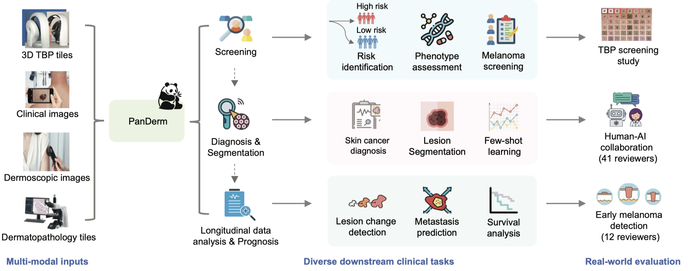

# PanDerm
A General-Purpose Multimodal Foundation Model for Dermatology
[[`Arxiv Paper`](https://arxiv.org/pdf/2410.15038)]
[[`Cite`](#citation)]

Warning: this repo is under construction.
## Introduction
Diagnosing and treating skin diseases require advanced visual skills across domains and the ability to
synthesize information from multiple imaging modalities. While current deep learning models excel at
specific tasks like skin cancer diagnosis from dermoscopic images, they struggle to meet the complex,
multimodal requirements of clinical practice. Here, we introduce PanDerm, a multimodal dermatology
foundation model pretrained through self-supervised learning on over 2 million real-world skin disease
images from 11 clinical institutions across 4 imaging modalities. We evaluated PanDerm on 28 diverse
benchmarks, including skin cancer screening, risk stratification, differential diagnosis of common and
rare skin conditions, lesion segmentation, longitudinal monitoring, and metastasis prediction and prognosis. PanDerm achieved state-of-the-art performance across all evaluated tasks, often outperforming
existing models when using only 10% of labeled data. We conducted three reader studies to assess PanDerm’s potential clinical utility. PanDerm outperformed clinicians by 10.2% in early-stage melanoma
detection through longitudinal analysis, improved clinicians’ skin cancer diagnostic accuracy by 11%
on dermoscopy images, and enhanced non-dermatologist healthcare providers’ differential diagnosis
by 16.5% across 128 skin conditions on clinical photographs. These results demonstrate PanDerm’s
potential to improve patient care across diverse clinical scenarios and serve as a model for developing
multimodal foundation models in other medical specialties, potentially accelerating the integration of AI
support in healthcare.



## About PanDerm

_**What is PanDerm?**_: PanDerm is a vision-centric multimodal foundation model pretrained on 2 million dermatological images. It provides specialized representations across four dermatological imaging modalities (dermoscopy, clinical images, TBP, and dermatopathology), delivering superior performance in skin cancer diagnosis, differential diagnosis of hundreds of skin conditions, disease progression monitoring, Total Body Photography applications, and image segmentation.

_**Why use PanDerm?**_: Compared to clinically popular CNN models like ResNet, PanDerm achieves better fine-tuning performance, especially with limited labeled data. Its linear probing performance approaches full-parameter fine-tuning results, offering researchers a computationally efficient alternative with lower implementation barriers. Both approaches make PanDerm ideal for replacing traditional CNNs in clinical applications, including human-AI collaboration, multimodal image analysis, and various diagnostic and progression tasks. PanDerm also demonstrates superior performance across diverse modalities and tasks compared to existing foundation models. Unlike web-scale pretrained models (e.g., DINOv2, SwavDerm, and DermFoundation), it minimizes data leakage risk while providing more reliable benchmark performance.

_**When use PanDerm?**_:
- For fine-tuning on dermatological task,s especially with limited labeled data
- To leverage its dermatology-specific features for linear probing and similar image retrieval
- To develop Total Body Photography-based AI applications
- As a powerful backbone for developing dermatology algorithms with significant performance improvements over existing backbones (e.g., ViT, DINOv2)
- As a specialized vision encoder for dermatological vision-language models and multimodal LLM development


### TODO

- **PanDerm-base**: The ViT-base version of PanDerm weights will be released, providing a general-purpose vision encoder for dermatology applications.
- **Finetune script**: Finetuning script of PanDerm.
- **PanDerm-v2**: PanDerm pretrained with more training data.

## Installation
First, clone the repo and cd into the directory:
```shell
git clone https://github.com/SiyuanYan1/PanDerm
cd PanDerm
```
Then create a conda env and install the dependencies:
```shell
conda create -n PanDerm python=3.10 -y
conda activate PanDerm
pip install torch==2.4.1 torchvision==0.19.1 torchaudio==2.4.1 --index-url https://download.pytorch.org/whl/cu118
pip install -r requirements.txt
```

## 1. Download PanDerm Pre-trained Weights

### Obtaining the Model Weights
Download the pre-trained model weights from [this Google Drive link](https://drive.google.com/file/d/1XHKRk2p-dS1PFQE-xRbOM3yx47i3bXmi/view?usp=sharing).

### Configuring the Model Path
After downloading, you need to update the model weights path in the code:

1. Open the file `PanDerm/linear_probe/models/builder.py`
2. Locate line 42
3. Replace the existing path with the directory where you saved the model weights:

```python
root_path = '/path/to/your/PanDerm/Model_Weights/'
```
## 2. Data Organization for Classification

We've pre-processed the public datasets used in this study. To reproduce the results reported in our paper and prevent data leakage between splits, please use these processed datasets.

If you wish to use our model with your own dataset, please organize it in the same format as these pre-processed datasets.

### Public Dataset Links and Splits

| Dataset | Processed Data | Original Data |
|---------|----------------|---------------|
| HAM10000 | [Download](https://drive.google.com/file/d/1D9Q4B50Z5tyj5fd5EE9QWmFrg66vGvfA/view?usp=sharing) | [Official Website](https://challenge.isic-archive.com/data/#2018) |
| BCN20000 | [Download](https://drive.google.com/file/d/1jn1h1jWjd4go7BQ5fFWMRBMtq7poSlfi/view?usp=sharing) | [Official Website](https://figshare.com/articles/journal_contribution/BCN20000_Dermoscopic_Lesions_in_the_Wild/24140028/1) |
| DDI | [Download](https://drive.google.com/file/d/1F5RVqBUIxYcub1OkBm6yHTyV2TkHc65B/view?usp=sharing) | [Official Website](https://ddi-dataset.github.io/index.html) |
| Derm7pt | [Download](https://drive.google.com/file/d/1OYAmqG93eWLdf7dIkulY_fr0ZScvRLRg/view?usp=sharing) | [Official Website](https://derm.cs.sfu.ca/Welcome.html) |
| Dermnet | [Download](https://drive.google.com/file/d/1WrvReon2gA3sF9rqQGqivglG7HLFJ8he/view?usp=sharing) | [Official Website](https://www.kaggle.com/datasets/shubhamgoel27/dermnet) |
| HIBA | [Download](https://drive.google.com/file/d/1Sg0gFhfBaNNoeunF7C0HZgDbp5EDV436/view?usp=sharing) | [Official Website](https://www.isic-archive.com) |
| MSKCC | [Download](https://drive.google.com/file/d/17ma4tREXHAq1ZcBT7lZBhwO-3UHSbDW2/view?usp=sharing) | [Official Website](https://www.isic-archive.com) |
| PAD-UFES | [Download](https://drive.google.com/file/d/1NLv0EH3QENuRxW-_-BSf4KMP9cPjBk9o/view?usp=sharing) | [Official Website](https://www.kaggle.com/datasets/mahdavi1202/skin-cancer) |
| PATCH16 | [Download](https://drive.google.com/file/d/1wDMIfYrQatkeADoneHgjXQrawVMK-TFL/view?usp=sharing) | [Official Website](https://heidata.uni-heidelberg.de/dataset.xhtml?persistentId=doi:10.11588/data/7QCR8S) |

**Note:** The processed datasets may differ slightly from those provided on the official websites. To ensure reproducibility of our paper's results, please use the processed data links provided above.

## 3. Linear Evaluation on Downstream Tasks

Training and evaluation using HAM10000 as an example. Replace csv path and root path with your own dataset.

### Key Parameters

- `nb_classes`: Set this to the number of classes in your evaluation dataset.
- `batch_size`: Adjust based on the memory size of your GPU.
- `percent_data`: Controls the percentage of training data used. For example, 0.1 means evaluate models using 10% training data. Modify this if you want to conduct label efficiency generalization experiments.

### Evaluation Command

```bash
cd linear_probe
CUDA_VISIBLE_DEVICES=0 python linear_eval.py \
  --batch_size 1000 \
  --model 'PanDerm' \
  --nb_classes 7 \
  --percent_data 1.0 \
  --csv_filename 'PanDerm_results.csv' \
  --output_dir "/path/to/your/PanDerm/LP_Eval/output_dir2/ID_Res/PanDerm_res/" \
  --csv_path "/path/to/your/PanDerm/Evaluation_datasets/HAM10000_clean/ISIC2018_splits/HAM_clean.csv" \
  --root_path "/path/to/your/PanDerm/Evaluation_datasets/HAM10000_clean/ISIC2018/"
```
### More Usage Cases

For additional evaluation datasets, please refer to the bash scripts for detailed usage. We provide running code to evaluate on 9 public datasets. You can choose the model from the available options.

To run the evaluations:

```bash
cd linear_probe
bash script/lp.sh
```
### Starter Code for Beginners: Loading and Using Our Model

Check out our easy-to-follow Jupyter Notebook:

[**HAM_clean_evaluation.ipynb**](linear_probe/notebooks/HAM_clean_evaluation.ipynb)

This notebook shows you how to:
- Load our pre-trained model
- Use it for feature extraction
- Perform basic classification

## 4. Skin Lesion Segmentation

Please refer to details [here](Segmentation.md).

## Citation
```bibtex
@misc{yan2024generalpurposemultimodalfoundationmodel,
      title={A General-Purpose Multimodal Foundation Model for Dermatology}, 
      author={Siyuan Yan and Zhen Yu and Clare Primiero and Cristina Vico-Alonso and Zhonghua Wang and Litao Yang and Philipp Tschandl and Ming Hu and Gin Tan and Vincent Tang and Aik Beng Ng and David Powell and Paul Bonnington and Simon See and Monika Janda and Victoria Mar and Harald Kittler and H. Peter Soyer and Zongyuan Ge},
      year={2024},
      eprint={2410.15038},
      archivePrefix={arXiv},
      primaryClass={cs.CV},
      url={https://arxiv.org/abs/2410.15038}, 
}
```
